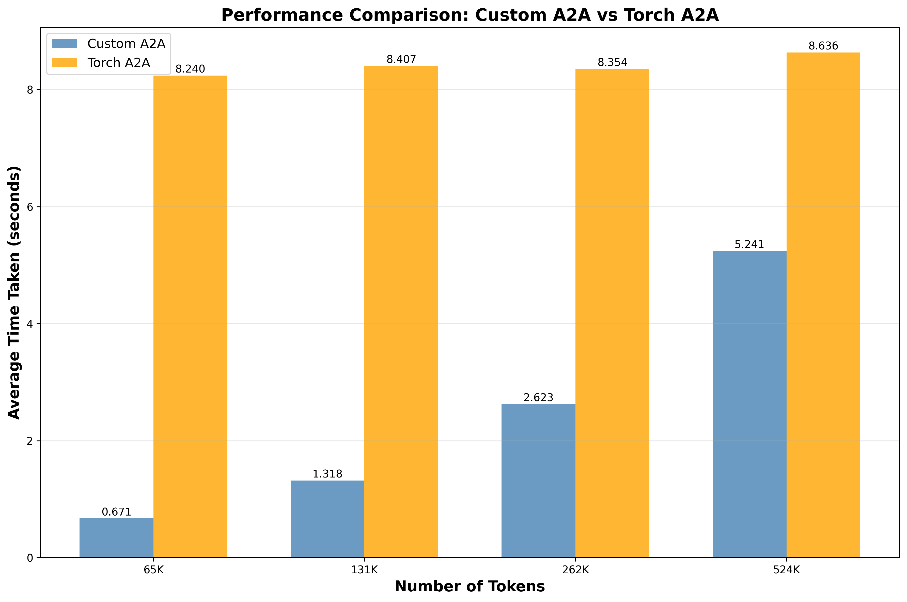

# Custom all-to-all kernels using NVShmem in triton

We implement a simple all-to-all kernel. The kernel currently supports the following flavour of a2a:
    1. Every pair of devices sends a message to another. 
    2. Each message size is a fixed constant.

We attach some preliminary benchmarks over an 8x(single-node)-MI250 cluster. The token-count represents the total number of tokens in-flight in the network due to *all* the messages sent by *all* the devices. The numbers are aggregrated across 10 a2as after some warmup. 

