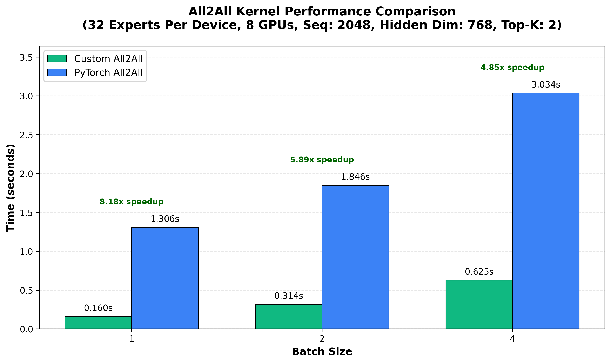
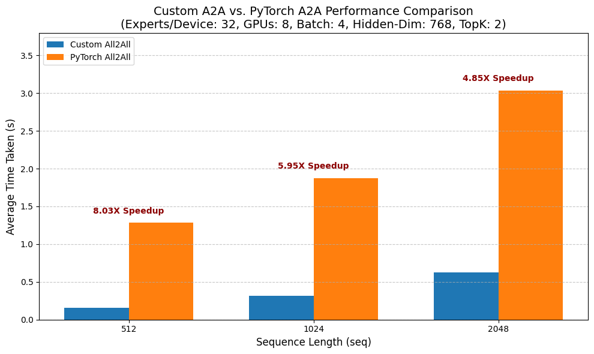
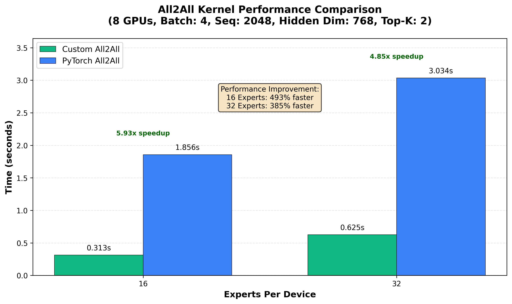
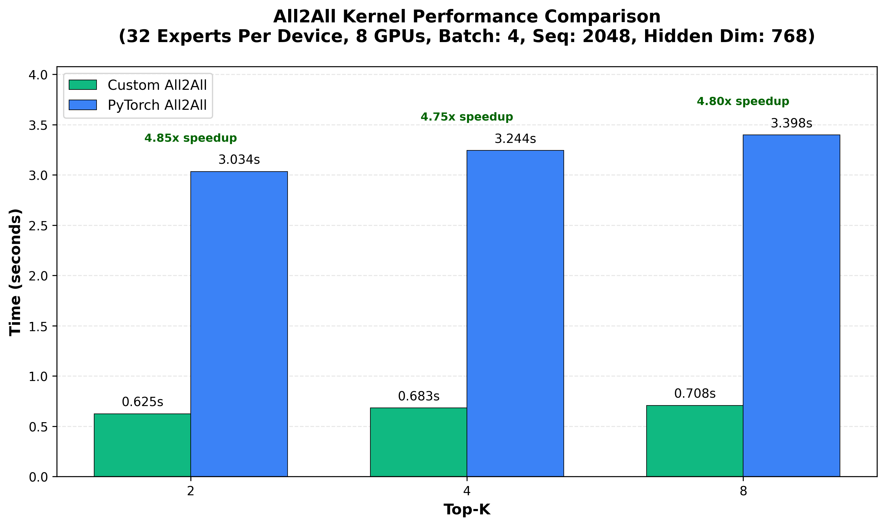

# Custom all-to-all kernels using NVShmem in triton

We implement a simple all-to-all kernel. The kernel currently supports the following flavour of a2a:
    1. Every pair of devices sends a message (consisteng of a number of tokens) to each-other. 
    2. Each message size is a fixed constant. This means every device sends the same number of tokens (possibly zero-padded) to each other device in the network.

The way we determine this message size is that we generate some fake-data, multiply it by a router and take the topk over softmax values. Since we know which experts are assigned to each device, we count the maximum number of tokens sent between a pair of device, call this M. We then send M tokens between each pair of devices (with zero-padding if fewer "real" tokens are intended to be sent between a pair). 

In this scenario we have some preliminary benchmarks over an 8x(single-node)-MI325X cluster. The numbers are aggregrated across 10 a2as after some warmup. 

First, we demonstrate how changing the batch size and sequence lengths impacts performance.

Interestingly speedups are higher for smaller batch-sizes and sequence-lengths. This is in-line with what SHmem is designed for: sending many small packets quickly.

Next, we demonstrate how changing the number of local experts impacts performance.

Though the speedups are still signifcant, it seems that smaller local-expert counts correspond to higher relative-performance. No idea why though.

Finally, we demonstrate how changing the topk value impacts performance.

These results are interesting, it seems in this setup performance is realtively insenstivie to topk. This is because of the way we determine how many tokens to send to another device, which causes zero-padding. Hence, I expect topk performance to be relatively "step-wise".